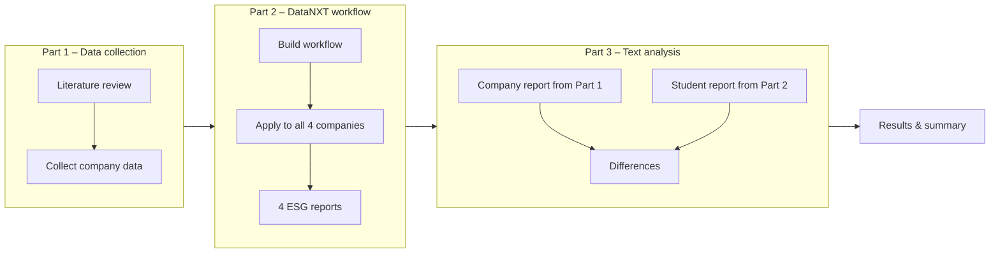

# Presentation on the ESG home assignment

**The assignment**

**Original ESG reports - Setting up my first python script**

My companies: Tesla, Volkswagen, Netflix, Disney

*pdf_downloader.py*

import requests

reports = {
    "2024": "https://www.tesla.com/ns_videos/2024-tesla-impact-report.pdf",
    "2023": "https://www.tesla.com/ns_videos/2023-tesla-impact-report.pdf",
    "2022": "https://www.tesla.com/ns_videos/2022-tesla-impact-report.pdf",
    "2021": "https://www.tesla.com/ns_videos/2021-tesla-impact-report.pdf",
    "2020": "https://www.tesla.com/ns_videos/2020-tesla-impact-report.pdf"
}

for year, url in reports.items():
    response = requests.get(url)
    filename = f"tesla_esg_{year}.pdf"
    with open(filename, "wb") as f:
        f.write(response.content)
    print(f"Downloaded {filename}")

**Results from the literature review on E, S, and G - Working with a coding agent**

**Collecting company data - Webscraping**

