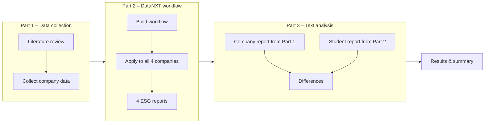

# Presentation on the ESG home assignment

## The assignment




## Original ESG reports - Setting up my first python script

**My companies:** Tesla, Volkswagen, Netflix, Disney

**The python script:** pdf_downloader.py

```python
import requests

reports = {
    "2024": "https://www.tesla.com/ns_videos/2024-tesla-impact-report.pdf",
    "2023": "https://www.tesla.com/ns_videos/2023-tesla-impact-report.pdf",
    "2022": "https://www.tesla.com/ns_videos/2022-tesla-impact-report.pdf",
    "2021": "https://www.tesla.com/ns_videos/2021-tesla-impact-report.pdf",
    "2020": "https://www.tesla.com/ns_videos/2020-tesla-impact-report.pdf"
}

for year, url in reports.items():
    response = requests.get(url)
    filename = f"tesla_esg_{year}.pdf"
    with open(filename, "wb") as f:
        f.write(response.content)
    print(f"Downloaded {filename}")
```


## Results from the literature review on E, S, and G - Working with a coding agent

**Key metrics of ESG reports:**

<table class="esg-table">
  <thead>
    <tr>
      <th class="th-e">🌍 Environmental (E)</th>
      <th class="th-s">👥 Social (S)</th>
      <th class="th-g">🏛️ Governance (G)</th>
    </tr>
  </thead>
  <tbody>
    <tr>
      <td><div class="metric">Scope 1 emissions</div><div class="desc">Direct CO₂ from own operations</div></td>
      <td><div class="metric">Employee headcount</div><div class="desc">Total employees, full/part time</div></td>
      <td><div class="metric">Board diversity</div><div class="desc">% women and minorities on board</div></td>
    </tr>
    <tr>
      <td><div class="metric">Scope 2 emissions</div><div class="desc">Indirect CO₂ from purchased energy</div></td>
      <td><div class="metric">Gender diversity</div><div class="desc">% women in workforce and leadership</div></td>
      <td><div class="metric">Board independence</div><div class="desc">% of independent directors</div></td>
    </tr>
    <tr>
      <td><div class="metric">Scope 3 emissions</div><div class="desc">All other indirect CO₂ (supply chain, customers)</div></td>
      <td><div class="metric">Pay gap</div><div class="desc">Difference in pay between men and women</div></td>
      <td><div class="metric">CEO pay ratio</div><div class="desc">CEO salary vs. average employee salary</div></td>
    </tr>
    <tr>
      <td><div class="metric">Energy consumption</div><div class="desc">Total energy used (MWh/GWh)</div></td>
      <td><div class="metric">Employee turnover</div><div class="desc">% of employees leaving per year</div></td>
      <td><div class="metric">Executive compensation</div><div class="desc">Total pay of top executives</div></td>
    </tr>
    <tr>
      <td><div class="metric">Renewable energy %</div><div class="desc">Share of energy from renewables</div></td>
      <td><div class="metric">Workplace injuries</div><div class="desc">Injury rate, lost workdays</div></td>
      <td><div class="metric">Anti-corruption policies</div><div class="desc">Whether policies exist and are enforced</div></td>
    </tr>
    <tr>
      <td><div class="metric">Water consumption</div><div class="desc">Liters/m³ used per year</div></td>
      <td><div class="metric">Training hours</div><div class="desc">Average hours of training per employee</div></td>
      <td><div class="metric">Data privacy incidents</div><div class="desc">Number of breaches or violations</div></td>
    </tr>
    <tr>
      <td><div class="metric">Waste generated</div><div class="desc">Tons of waste, recycling rate</div></td>
      <td><div class="metric">Supply chain audits</div><div class="desc">% of suppliers audited for labor standards</div></td>
      <td><div class="metric">Shareholder votes</div><div class="desc">Results of key ESG-related votes</div></td>
    </tr>
    <tr>
      <td><div class="metric">Carbon intensity</div><div class="desc">CO₂ per unit of revenue or product</div></td>
      <td><div class="metric">Community investment</div><div class="desc">Money invested in local communities</div></td>
      <td><div class="metric">Whistleblower policy</div><div class="desc">Whether a reporting mechanism exists</div></td>
    </tr>
  </tbody>
</table>


**Differences in ESG reports according to the industry:**

<table class="ind-table">
  <thead>
    <tr>
      <th style="width: 20%">Industry</th>
      <th style="width: 45%">Key focus areas</th>
      <th style="width: 35%">Relevant framework</th>
    </tr>
  </thead>
  <tbody>
    <tr>
      <td><span class="ind-name">🛢️ Oil & Gas</span></td>
      <td>Scope 1-3 emissions, spills, methane leaks</td>
      <td><span class="tag tag-teal">TCFD</span><span class="tag tag-blue">SASB</span></td>
    </tr>
    <tr>
      <td><span class="ind-name">🏦 Banking</span></td>
      <td>Financed emissions, lending to fossil fuels</td>
      <td><span class="tag tag-teal">PCAF</span><span class="tag tag-blue">TCFD</span></td>
    </tr>
    <tr>
      <td><span class="ind-name">💻 Tech</span></td>
      <td>Data privacy, energy use of data centers, supply chain labor</td>
      <td><span class="tag tag-blue">SASB</span><span class="tag tag-purple">GRI</span></td>
    </tr>
    <tr>
      <td><span class="ind-name">🚗 Automotive</span></td>
      <td>Fleet emissions, EV transition, supply chain minerals</td>
      <td><span class="tag tag-purple">GRI</span><span class="tag tag-teal">TCFD</span></td>
    </tr>
    <tr>
      <td><span class="ind-name">👗 Fashion</span></td>
      <td>Water use, child labor, chemical discharge</td>
      <td><span class="tag tag-purple">GRI</span><span class="tag tag-amber">ZDHC</span></td>
    </tr>
    <tr>
      <td><span class="ind-name">🌾 Food & Agriculture</span></td>
      <td>Land use, water, pesticides, farmer welfare</td>
      <td><span class="tag tag-purple">GRI</span><span class="tag tag-green">TNFD</span></td>
    </tr>
    <tr>
      <td><span class="ind-name">🎬 Entertainment</span></td>
      <td>Data center energy, production emissions, on-screen diversity, labor rights, content governance, data privacy</td>
      <td><span class="tag tag-purple">GRI</span><span class="tag tag-blue">SASB</span><span class="tag tag-teal">TCFD</span><span class="tag tag-coral">PAS 2060</span></td>
    </tr>
  </tbody>
</table>


## Collecting company data - Webscraping


